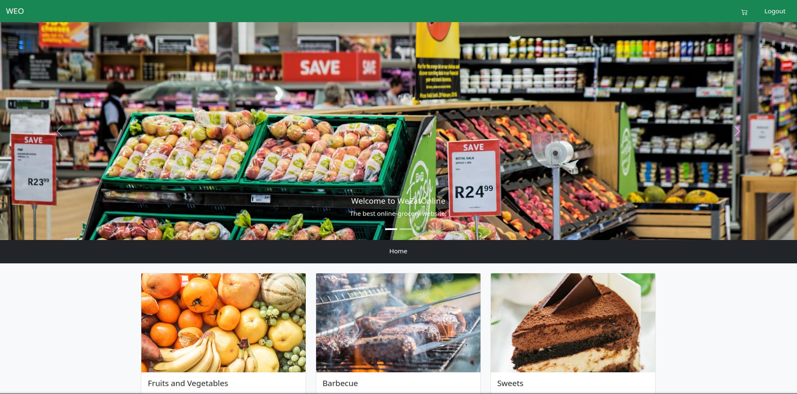

# WeEatOnline

<p align="center"></p>

<p align="center">
    <a href="https://soen287.herokuapp.com"></a>
    <a href="https://github.com/alexandre-lavoie/SOEN287/main/LICENSE">
        </a>
    <a href="https://soen287.herokuapp.com">
        
    </a>
</p>

## Overview

WeEatOnline is a E-Grocery website created for SOEN287. The website is written in vanilla PHP, using a custom framework similar to React and Laravel. All data is stored in unencrypted XML format. This means that the website is meant to be used as a prototype and **should not be used in production**.

## Getting Started

To run the website in a development environment, you will need Docker. You then simply have to run:

```
sudo docker-compose up
```

An instance of the website should run at http://locahost.